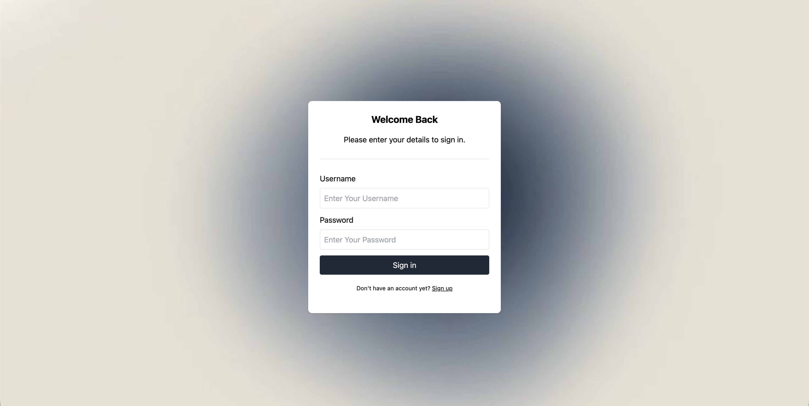
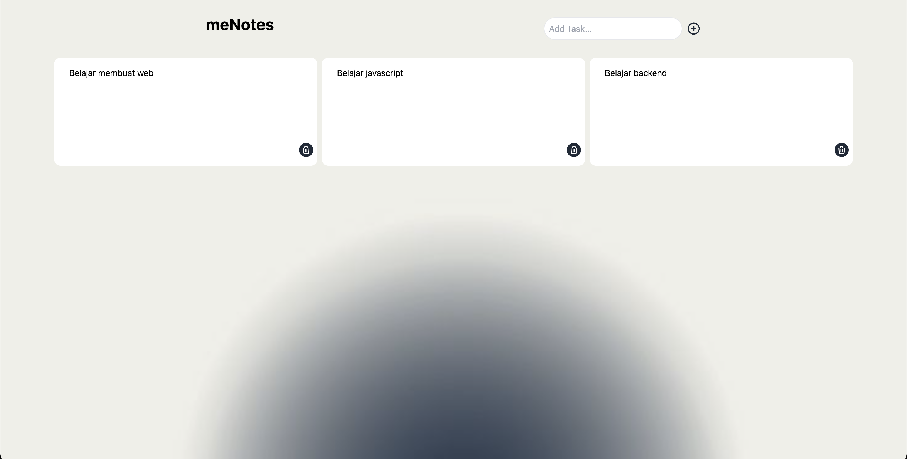
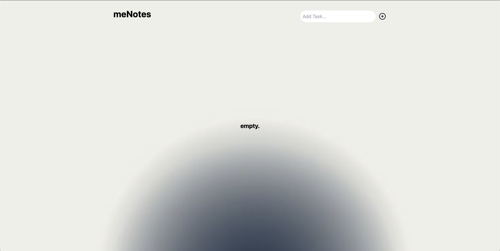

# meNotes — Fullstack Task Management App



> A clean and responsive task management application built with React, Express.js, and MySQL.

---

## Screenshots

| Login Page | Dashboard |
|---|---|
|  |  |

| Register Page | Empty State |
|---|---|
|  |  |

---

## Features

- User authentication with JWT (register & login)
- Create, read, and delete tasks
- Each user can only access their own data
- Responsive UI with Tailwind CSS
- Secure API with protected routes

---

## Tech Stack

**Frontend**
- [React](https://react.dev/) — UI library
- [Tailwind CSS](https://tailwindcss.com/) — Utility-first styling
- [Tabler Icons](https://tabler.io/icons) — Icon library

**Backend**
- [Express.js](https://expressjs.com/) — Node.js web framework
- [MySQL](https://www.mysql.com/) — Relational database
- [JWT](https://jwt.io/) — Secure authentication tokens
- [bcrypt](https://www.npmjs.com/package/bcrypt) — Password hashing

---

## Getting Started

### Prerequisites

Make sure you have the following installed:
- [Node.js](https://nodejs.org/) v18+
- [MySQL](https://www.mysql.com/) v8+
- npm or yarn

### 1. Clone the Repository

```bash
git clone https://github.com/your-username/menotes.git
cd menotes
```

### 2. Setup the Database

Create a MySQL database and run the following SQL:

```sql
CREATE DATABASE menotes;

USE task_manager;

CREATE TABLE users (
  id INT AUTO_INCREMENT PRIMARY KEY,
  username VARCHAR(255) NOT NULL UNIQUE,
  password VARCHAR(255) NOT NULL,
  created_at TIMESTAMP DEFAULT CURRENT_TIMESTAMP
);

CREATE TABLE tasks (
  id INT AUTO_INCREMENT PRIMARY KEY,
  user_id INT NOT NULL,
  title VARCHAR(255) NOT NULL,
  created_at TIMESTAMP DEFAULT CURRENT_TIMESTAMP,
  FOREIGN KEY (user_id) REFERENCES users(id) ON DELETE CASCADE
);
```

### 3. Configure the Backend

```bash
cd backend
npm install
```

Create a `.env` file in the `backend/` directory:

```env
PORT=5000
DB_HOST=localhost
DB_USER=root
DB_PASSWORD=your_password
DB_NAME=task_manager
JWT_SECRET=your_jwt_secret_key
```

Start the backend server:

```bash
npm run dev
```

### 4. Configure the Frontend

```bash
cd frontend
npm install
npm run dev
```

The app will be available at `http://localhost:5173`.

---

## API Endpoints

### Authentication

| Method | Endpoint | Description |
|--------|----------|-------------|
| `POST` | `/api/auth/register` | Register a new user |
| `POST` | `/api/auth/login` | Login and receive JWT token |

### Tasks *(requires Authorization header)*

| Method | Endpoint | Description |
|--------|----------|-------------|
| `GET` | `/api/tasks` | Get all tasks for the logged-in user |
| `POST` | `/api/tasks` | Create a new task |
| `DELETE` | `/api/tasks/:id` | Delete a task by ID |

**Authorization header format:**
```
Authorization: Bearer <your_jwt_token>
```

---

## Security

- Passwords are hashed using **bcrypt** before being stored in the database
- All task routes are protected with JWT middleware — unauthenticated requests are rejected
- Each user can only read and modify their own tasks

---

## Roadmap

- [ ] add new tasks
- [ ] delete tasks

---

## Author

**Faza**
- GitHub: [@fazabsharcontact](https://github.com/fazabsharcontact)


